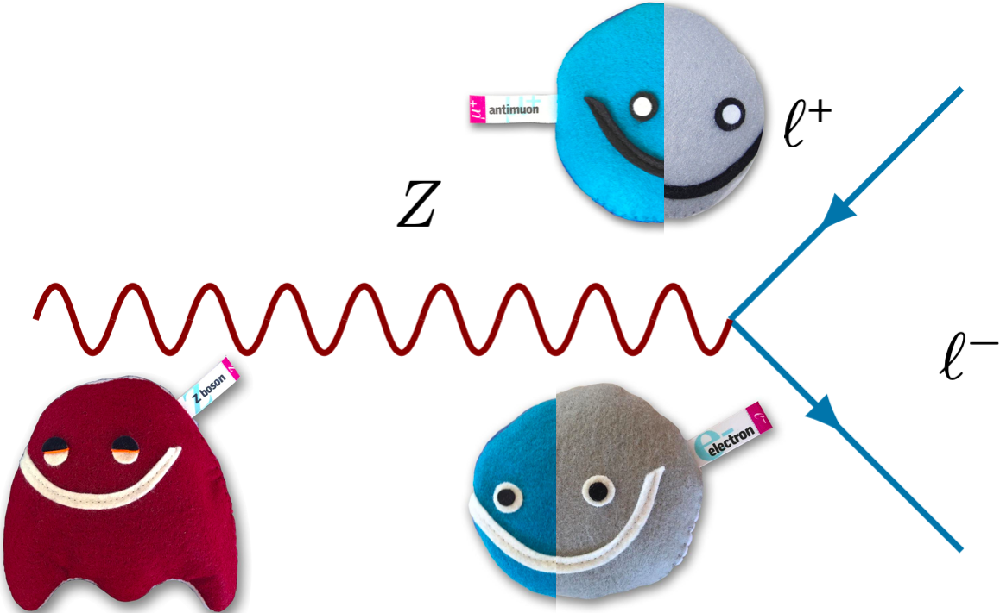

# How-to-rediscover-the-Z
## Jupyter notebook with steps to rediscover the Z boson yourself!
------

## Get Started (online)
Click here! ---> 

Click on How-to-rediscover-the-Z.ipynb

## Get Started (on your own laptop)
Download this repository as a ZIP https://github.com/meevans1/How-to-rediscover-the-Z/archive/master.zip

Unzip the file in the Downloads folder on your computer

Open a [Jupyter notebook](https://jupyter.org) using your favourite [Python](https://www.python.org) (3.6 or above) environment (mine is [Anaconda](https://www.anaconda.com/distribution/))

Click on How-to-rediscover-the-Z.ipynb (either the original one you downloaded or your version that you downloaded)

